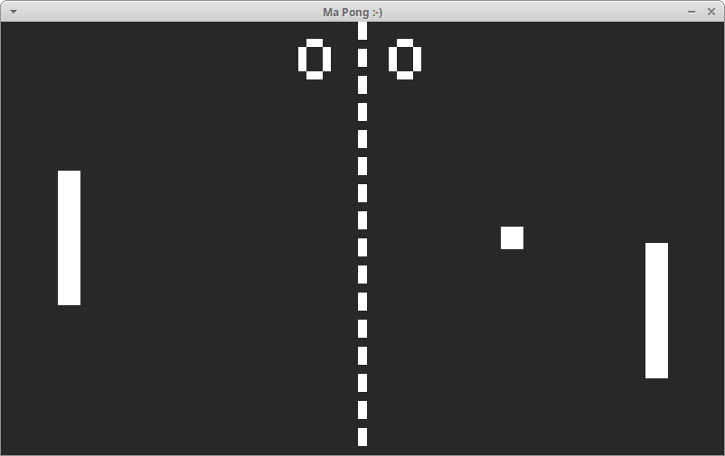

# MaPong
> Just 4 FUN

Ping-pong игра на движке Allegro 5 с использованием [ALX](https://github.com/axilmar/ALX) (C++11 Allegro 5 wrapper library)
<br>Скоро ~~со вкусом банана~~ будет возможна игра по сети


## Build

### Also you need:
boost/program_options
```sh
sudo apt-get install libboost-all-dev # apt search boost # https://stackoverflow.com/a/12578564
```

### Linux:
```sh
sudo apt install liballegro5-dev
git clone https://github.com/Lazzlo2096/maPong.git --recurse-submodules --shallow-submodules
cd ./maPong/
make
```
### Windows:
Для начала, вам нужно [отсюда](https://www.allegro.cc/files/?v=5.0) установить Allegro 5.0.10 в ваш MinGW. [(типа инструкция)](https://www.allegro.cc/forums/thread/611687)
<br>Затем:
```sh
git clone https://github.com/Lazzlo2096/maPong.git --recurse-submodules --shallow-submodules
make windows
```

## Дополнительные материалы

Шрифт ``04B_03__.TTF`` был скачан [отсюда](http://dsg4.com/04/extra/bitmap/)

## Release History

<!-- * 0.2.1
    * CHANGE: Update docs (module code remains unchanged)
* 0.2.0
    * CHANGE: Remove `setDefaultXYZ()`
    * ADD: Add `init()`
* 0.1.1
    * FIX: Crash when calling `baz()` (Thanks @GenerousContributorName!) -->
* 0.1.1
    * Теперь собирается на Windows
    * FIX: забыл добавить al_init_primitives_addon() (до этого почему-то работало 😅)
* 0.1.0
    * Первый годный релиз
    * Реализован основной функционал игры
* 0.0.1
    * Сырой прототип

## Meta

Distributed under the LGPL-3.0 license. See ``LICENSE`` for more information.

[https://github.com/Lazzlo2096](https://github.com/Lazzlo2096)
